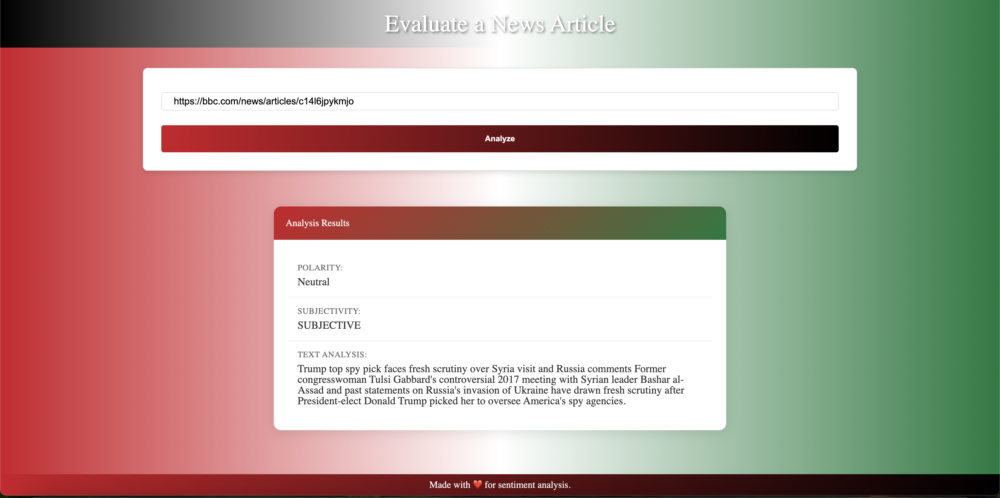
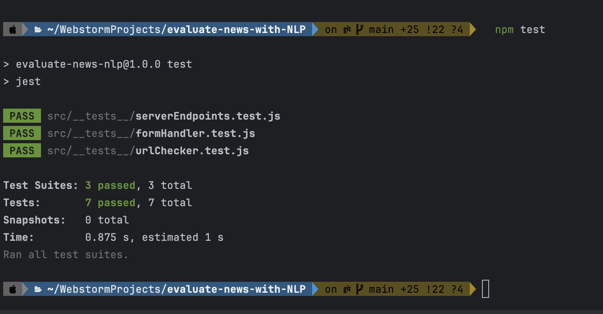

# News Article Sentiment Analyzer

Analyzes news articles for sentiment and subjectivity using MeaningCloud's API.


*Homepage with URL input*

## Features
- URL validation
- Text extraction from articles
- Sentiment analysis
- Polarity scoring
- Subjectivity detection
- Palestine-themed UI design
- Offline functionality
- Responsive design

## Prerequisites
- Node.js v20.x
- MeaningCloud API key

## Installation

1. Clone repository
```bash
    git clone https://github.com/yourusername/news-sentiment-analyzer.git
```
```
  cd news-sentiment-analyzer
````

2. Install dependencies
```bash
    npm install
```

3. Create `.env` file
```env
MEANINGCLOUD_API_KEY=your_api_key_here
```

## Development
### start the server
```bash
  npm start 
  ````
### start the client in dev mode
```bash
  npm run build-dev
```

## Production
### Build and start the production server
```bash
  npm run build-prod
````
### Start server
```bash
  npm start
```

## Dependencies
```json
{
  "dependencies": {
    "axios": "^1.7.8",
    "cheerio": "^1.0.0",
    "cors": "^2.8.5",
    "dotenv": "^16.4.5",
    "express": "^4.17.1"
  }
}
```

## Dev Dependencies
```json
{
  "devDependencies": {
    "@babel/core": "^7.5.4",
    "@babel/preset-env": "^7.5.4",
    "babel-loader": "^8.0.6",
    "clean-webpack-plugin": "^4.0.0",
    "css-loader": "^6.10.0",
    "html-webpack-plugin": "^5.6.0",
    "jest": "^29.7.0",
    "sass": "^1.81.0",
    "sass-loader": "^12.6.0",
    "style-loader": "^3.3.4",
    "webpack": "^5.90.3",
    "webpack-cli": "^5.1.4",
    "webpack-dev-server": "^4.7.0",
    "workbox-webpack-plugin": "^7.0.0"
  }
}
```

## Example API Response
```javascript
{
  "polarity": "Neutral",
  "subjectivity": "SUBJECTIVE",
  "text": "Article excerpt...",
  "confidence": 98
}
```

## Key Technologies
- Frontend: HTML, SCSS, React
- Backend: Express, Node.js
- APIs: MeaningCloud
- Build Tools: Webpack
- Testing: Jest
- PWA: Workbox
- CSS Preprocessor: Sass
- Package Manager: npm

## Testing
```bash
  npm test
```



## Getting Started
1. Sign up for a free API key at [MeaningCloud](https://www.meaningcloud.com/)
2. Configure your environment variables
3. Install dependencies and start developing

